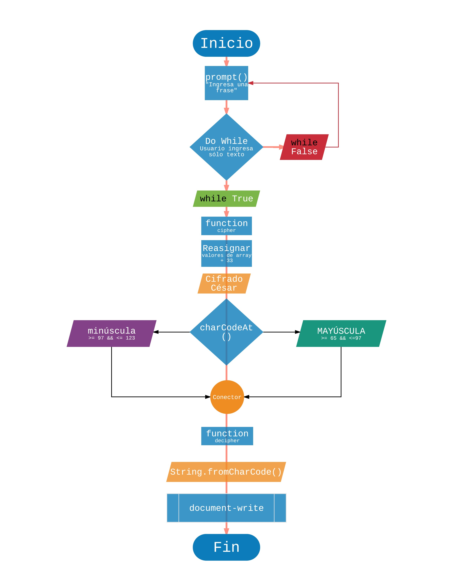

# INSTRUCCIONES
CIFRADO CÉSAR

Crea una web que pida, por medio de un prompt(), una frase al usuario y devuelva el mismo mensaje encriptado según el algoritmo de Cifrado César con el parámetro de desplazamiento de 33 espacios hacia la derecha

1. Tu programa debe ser capaz de cifrar y descifrar tanto letras mayúsculas como minúsculas. La fórmula para descifrar es: (x - n) % 26
2. Tu código debe estar compuesto por 2 funciones con los siguientes nombres: cipher y decipher
3. El usuario no debe poder ingresar un campo vacío o que contenga números

## PSEUDOCÓDIGO

INICIO
1. Crear un prompt() que pida una frase al usuario
  1. a)Do while: el usuario ingrese campo vacío ('') o numbers.
2. Almacenar el valor del texto ingresado, en una variable.
3. Crear una "function cipher" que desplace 33 espacios hacia la derecha del alfabeto.
  3. a)Leer texto y detectar posición en código ASCII por medio de charCodeAt().
    3. a) a)Mayúsculas >= 65 && <=97
    3. a) b)Minúsculas >= 97 && <= 123
4. Una vez obtenida la frase en código ASCII: crear una "function decipher" que utilice String.fromCharCode() para convertir el texto cifrado a "string".
5. Devolver por medio de un document.write el mensaje encriptado.
FIN

### DIAGRAMA DE FLUJO
;
