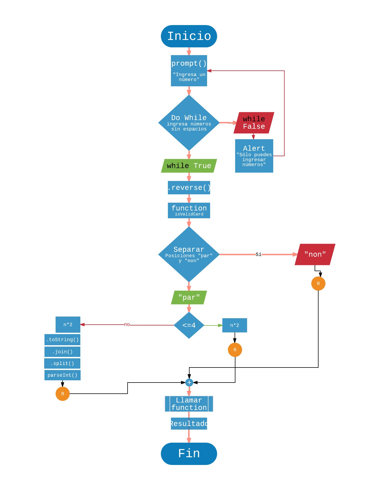

# INSTRUCCIONES
TARJETA DE CRÉDITO VÁLIDA

Crea una web que pida, por medio de un prompt(), el número de una tarjeta de crédito y confirme su validez según el algoritmo de Luhn.

1. Tu código debe estar compuesto por 1 función: isValidCard
2. El usuario no debe poder ingresar un campo vacío

## PSEUDOCÓDIGO
1. Crear una web que pida al usuario por medio de un prompt() un número de tarjeta de crédito.
  1. Do while "Sólo puedes ingresar números, sin espacios" y volver a mostrar el prompt(); si el usuario ingresa letras o espacios
2. Tomar los números ingresados por el usuario e invertir su posición por medio de .reverse
3. Almacenar en variables los números con posición "par" y "non"
4. Crear function isValidCard
  4. 1. Sumar números en posición "non" por medio de un for y guardar resultado en una variable
  4. 2. Determinar por medio de 'else if' si el número es menor o igual (<=) a 4, si es true: multiplicar por dos y guardar suma de los elementos en una variable.
    4. 2.1 Caso contrario (false) / 'else' multiplicar por 2 y convertir a string por medio de .toString() dentro de un array.
      4. 2.1.1 Juntar elementos de propiedades en un sólo string por medio de .join() y separar cada uno de ellos por medio de .split()
      4. 2.1.2 Eliminar espacios con .slice() / .delete()
      4. 2.1.3 Convertir a números y sumar elementos. Guardar resultado en una variable
5. Sumar 3 resultados; si el resultado %10 == 0 // Devolver document.write("El número de TC que ingresaste es válida"). Caso contrario documen.write("La tarjeta es inválida")

### DIAGRAMA DE FLUJO
;
